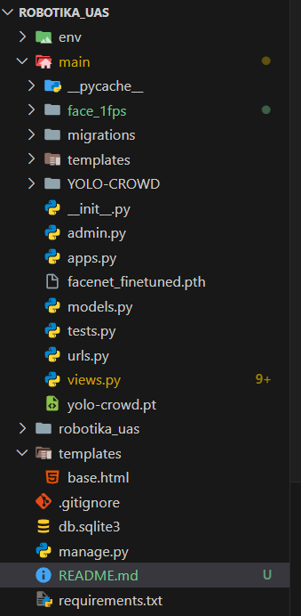

# Tutorial Cara Menjalankan Proyek

1. Git clone repository ini
2. Git clone repository ini di dalam folder main: https://github.com/zaki1003/YOLO-CROWD.git
3. Copas folder face_1fps ke dalam folder main
4. Masukkan semua model ke dalam folder main (yolo-crowd.pt dan facenet_finetuned.pth)
5. Struktur folder main yang valid adalah sebagai berikut
